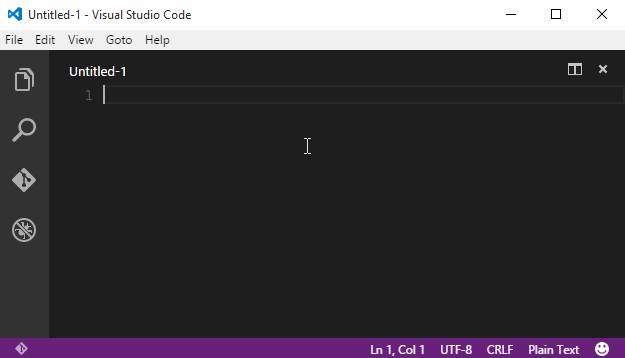
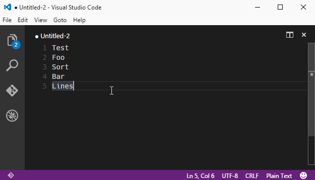

# Functionality

Sort lines of text in Visual Studio Code. The following types of sorting are supported:

- `Sort lines` - Regular character code based sort (F9)
- `Sort lines (case insensitive)` - Case insensitive sort
- `Sort lines (line length)` - Sort lines by line length
- `Sort lines (reverse)` - Reverse character code based sort
- `Sort lines (unique)` - Regular character code keeping only unique items
- `Sort lines (random)` - Sort lines randomly

# Install

1. Open VS Code
2. Press F1
3. Type "install"
4. Select "Extensions: Install Extension".
5. Select sort-lines from the list

# Usage

Select the lines to sort, press F1 type sort and select the desired sort. The regular sort has the default hotkey F9.

